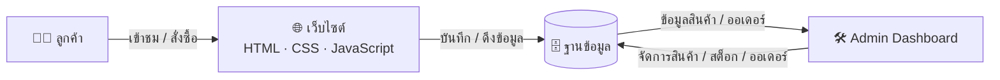
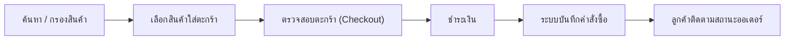

# 🌸 Maison Véra

### แพลตฟอร์มอีคอมเมิร์ซเครื่องสำอางและสกินแคร์ครบวงจร

**เว็บไซต์ขายเครื่องสำอางออนไลน์ ตั้งแต่หน้าร้านสำหรับลูกค้าไปจนถึงระบบหลังบ้านสำหรับแอดมิน**

📖 [เอกสารระบบ](#-เอกสารประกอบโครงงาน) ·

---

## 📚 สารบัญ

- [เกี่ยวกับโครงงาน](#-เกี่ยวกับโครงงาน)
- [ผู้จัดทำ](#-ผู้จัดทำ)
- [Persona Design](#-persona-design-การออกแบบตัวละครผู้ใช้งานจำลอง)
- [เป้าหมายทางธุรกิจ](#-เป้าหมายทางธุรกิจ)
- [ฟีเจอร์ของระบบ](#-ฟีเจอร์ของระบบ)
- [เทคโนโลยีที่ใช้](#-เทคโนโลยีที่ใช้)
- [สถาปัตยกรรมระบบ](#-สถาปัตยกรรมระบบ)
- [การออกแบบ UI](#-การออกแบบ-ui)
- [การออกแบบ UML](#-การออกแบบ-uml)
- [User Acceptance Testing](#-user-acceptance-testing-uat)
- [SLA และแผนการดูแลระบบหลังส่งมอบ](#-sla-และแผนการดูแลระบบหลังส่งมอบ)
- [แผนพัฒนาต่อในอนาคต](#-แผนพัฒนาต่อในอนาคต)
- [License](#-license)

---

## 💡 เกี่ยวกับโครงงาน

**Maison Véra** คือโครงงานเว็บไซต์อีคอมเมิร์ซสำหรับขายเครื่องสำอางและผลิตภัณฑ์สกินแคร์ พัฒนาขึ้นในรายวิชา **CSI204 - ดิจิทัลแพลตฟอร์มสำหรับพัฒนาซอฟต์แวร์**

แนวคิดเริ่มต้นมาจากการสังเกตพฤติกรรมลูกค้าเครื่องสำอางยุคใหม่ ที่ต้องการค้นหาสินค้าที่ต้องการผิวหรือหมวดหมู่ได้ง่าย เปรียบเทียบสินค้าได้รวดเร็ว และชำระเงินได้อย่างปลอดภัยโดยไม่ต้องออกจากบ้าน ทีมผู้จัดทำจึงออกแบบ Maison Véraให้เป็นแพลตฟอร์มที่ครบทั้งฝั่งลูกค้าและฝั่งผู้ดูแลร้าน โดยเน้นดีไซน์โทนสี **rose-gold** ที่สื่อถึงความหรูหราและอ่อนโยน เหมาะกับกลุ่มสินค้าความงาม

ระบบแบ่งออกเป็น 2 ส่วนหลัก คือ **หน้าร้านสำหรับลูกค้า** ที่ให้เลือกซื้อสินค้า ค้นหา และชำระเงิน และ **แดชบอร์ดผู้ดูแลระบบ** ที่ใช้จัดการสินค้า สต็อก คำสั่งซื้อ และดูรายงานยอดขาย

---

## 👥 ผู้จัดทำ

| ชื่อ-นามสกุล | บทบาท | GitHub |
|---|---|---|
| [67133846 วรัตถา เตนากุล] | Project Manager | [@warattha48](https://github.com/warattha48) |
| [67167033 เปมิกา เมฆลอย] | Frontend Developer | [@l0w0l-0](https://github.com/l0w0l-0) |
| [67180663 ภัทรพล ถ่อมดี] | UI/UX Designer | [@noinahjajah](https://github.com/noinahjajah) |

> จัดทำในรายวิชา **CSI204 - ดิจิทัลแพลตฟอร์มสำหรับพัฒนาซอฟต์แวร์**

---

## 🎭 Persona Design (การออกแบบตัวละครผู้ใช้งานจำลอง)

เพื่อทำความเข้าใจความต้องการของลูกค้า จึงได้ออกแบบ Persona ของกลุ่มเป้าหมายหลัก ดังนี้

> **👤 พริมรตา (พริม) - "The Mindful Minimalist"**
> *"การดูแลตัวเองไม่ใช่ความฟุ่มเฟือย แต่คือการลงทุนและให้รางวัลกับตัวเองในทุกๆ วันที่เหนื่อยล้า"*

*   **ข้อมูลเบื้องต้น:** อายุ 28 ปี / ผู้จัดการฝ่ายการตลาด / รายได้ 45,000 - 60,000 บาท
*   **ไลฟ์สไตล์:** ใช้ชีวิตเร่งรีบ ทำงานหนัก ชอบความเรียบง่าย (Minimal) และเน้นคุณภาพสินค้ามากกว่าปริมาณ
*   **ความต้องการ (Needs):** แพลตฟอร์มที่สะอาดตา (Clean UI) ค้นหาง่าย และขั้นตอนชำระเงินที่สั้นและรวดเร็ว
*   **ปัญหาที่พบ (Pain Points):** ไม่มีเวลาไปเดินซื้อสินค้า, รำคาญการกรอกข้อมูลสมัครสมาชิกที่ยาวเกินไป และหงุดหงิดหากติดตามสถานะพัสดุไม่ได้
*   **การใช้เทคโนโลยี:** เชี่ยวชาญสูง (Mobile-first) มักช้อปปิ้งช่วงพักกลางวัน หรือก่อนนอน (21:00 - 23:00 น.)

---

> **👤 นภัสกร (นัท) - "The Beauty Explorer"**
> *"ชีวิตนี้ต้องลองให้หมด สกินแคร์เทรนด์ใหม่มาแป๊บเดียวก็ต้องมีในตะกร้าแล้ว"*

*   **ข้อมูลเบื้องต้น:** อายุ 20 ปี / นักศึกษาปี 2 / รายได้จากค่าขนม 5,000 - 8,000 บาท/เดือน
*   **ไลฟ์สไตล์:** ตามเทรนด์ความงามจาก TikTok/Instagram ตลอดเวลา ชอบทดลองสินค้าใหม่ๆ ราคาย่อมเยา ซื้อบ่อยแต่ทีละน้อย
*   **ความต้องการ (Needs):** ระบบรีวิว/เรตติ้งสินค้าที่น่าเชื่อถือ โปรโมชั่น/ส่วนลดที่ชัดเจน และฟีเจอร์เปรียบเทียบสินค้า
*   **ปัญหาที่พบ (Pain Points):** งบจำกัดแต่อยากได้ของครบ, ไม่แน่ใจว่าสินค้าตรงปกไหมก่อนสั่ง, กังวลเรื่องค่าส่งที่แพงเกินไปเมื่อเทียบกับยอดซื้อ
*   **การใช้เทคโนโลยี:** เชี่ยวชาญสูงมาก ใช้มือถือเป็นหลัก 100% ช้อปช่วงมีโปรโมชั่นหรือหลังเห็นรีวิวจากอินฟลูเอนเซอร์

---

> **👤 สุนีย์ (ป้าหนี) - "The Cautious Caregiver"**
> *"ก่อนซื้ออะไรให้ตัวเองหรือลูก ต้องอ่านให้ละเอียด เชื่อได้จริงถึงจะกล้าจ่าย"*

*   **ข้อมูลเบื้องต้น:** อายุ 45 ปี / เจ้าของธุรกิจส่วนตัว / รายได้ 30,000 - 40,000 บาท/เดือน
*   **ไลฟ์สไตล์:** ดูแลทั้งตัวเองและครอบครัว ให้ความสำคัญกับความปลอดภัยและส่วนผสมของผลิตภัณฑ์มากกว่าราคา
*   **ความต้องการ (Needs):** ข้อมูลส่วนผสม/แหล่งผลิตที่ชัดเจนในหน้ารายละเอียดสินค้า ช่องทางติดต่อแอดมิน/ฝ่ายบริการลูกค้าที่เข้าถึงง่าย และระบบติดตามพัสดุที่อัปเดตแม่นยำ
*   **ปัญหาที่พบ (Pain Points):** ไม่มั่นใจการชำระเงินออนไลน์ กลัวโดนหลอก, ตัวอักษร/ปุ่มบนเว็บเล็กเกินไปทำให้อ่านยาก, ไม่ชอบขั้นตอนสมัครสมาชิกที่ซับซ้อน
*   **การใช้เทคโนโลยี:** ปานกลาง ใช้คอมพิวเตอร์ตั้งโต๊ะเป็นหลักมากกว่ามือถือ ช้อปช่วงกลางวันเวลาว่างจากร้าน

---

> **👤 กันตพงศ์ (เก่ง) - "The Store Operator"**
> *"สต็อกต้องแม่น ออเดอร์ต้องไว ยอดขายต้องเห็นภาพรวมได้ในคลิกเดียว"*

*   **ข้อมูลเบื้องต้น:** อายุ 32 ปี / แอดมินร้าน/เจ้าหน้าที่คลังสินค้า / ดูแลระบบหลังบ้านของ Maison Véra
*   **ไลฟ์สไตล์:** ทำงานหน้าจอทั้งวัน ต้องจัดการสินค้า สต็อก และคำสั่งซื้อจำนวนมากพร้อมกันให้ทันเวลา
*   **ความต้องการ (Needs):** แดชบอร์ดที่สรุปข้อมูลสำคัญได้รวดเร็ว (ยอดขาย/สต็อกใกล้หมด/ออเดอร์ค้าง) ฟีเจอร์จัดการสินค้าแบบ Bulk Action และระบบแจ้งเตือนเมื่อสต็อกต่ำ
*   **ปัญหาที่พบ (Pain Points):** ต้องสลับหน้าไปมาหลายจุดเพื่อจัดการงานเดียว, ข้อมูลสต็อก/คำสั่งซื้อไม่อัปเดตเรียลไทม์ ทำให้ขายสินค้าเกินสต็อก, ตรวจสอบสถานะการชำระเงินยาก
*   **การใช้เทคโนโลยี:** เชี่ยวชาญสูง ใช้ระบบแอดมินตลอดเวลาทำงาน (09:00 - 18:00 น.) ผ่านคอมพิวเตอร์เป็นหลัก

---

## 🎯 เป้าหมายทางธุรกิจ

| เป้าหมาย | รายละเอียด |
|---|---|
| 🛒 ขยายช่องทางขาย | เปิดช่องทางขายออนไลน์เพิ่มเติมนอกเหนือจากหน้าร้าน |
| ✨ ยกระดับประสบการณ์ลูกค้า | ให้ลูกค้าค้นหาและเลือกซื้อสินค้าได้สะดวก รวดเร็ว |
| 🔒 ระบบซื้อขายที่ปลอดภัย | รองรับการชำระเงินออนไลน์ที่เชื่อถือได้ |
| 📈 เพิ่มรายได้ธุรกิจ | สร้างช่องทางรายได้ใหม่ให้ธุรกิจเติบโต |
| 🚀 รองรับการขยายระบบในอนาคต | ออกแบบสถาปัตยกรรมให้ต่อยอดฟีเจอร์ใหม่ได้ง่าย |

---

## ✅ ฟีเจอร์ของระบบ

<table>
<tr>
<td valign="top" width="50%">

### 👤 ฝั่งลูกค้า

- ✅ หน้าแรก (Home)
- ✅ สมัครสมาชิก / เข้าสู่ระบบ
- ✅ แสดงสินค้าทั้งหมด (Product Catalog)
- ✅ หน้ารายละเอียดสินค้า
- ✅ ค้นหาสินค้า
- ✅ ตะกร้าสินค้า
- ✅ ขั้นตอนชำระเงิน (Checkout)
- ✅ โปรไฟล์ผู้ใช้
- ✅ ประวัติคำสั่งซื้อ
- ⏳ รีวิวสินค้า

</td>
<td valign="top" width="50%">

### 🛠️ ฝั่งผู้ดูแลระบบ

- ✅ ภาพรวมแดชบอร์ด
- ✅ จัดการสินค้า
- ✅ จัดการหมวดหมู่
- ✅ จัดการสต็อกสินค้า
- ✅ จัดการข้อมูลลูกค้า
- ✅ จัดการคำสั่งซื้อ
- ✅ จัดการการชำระเงิน
- ✅ รายงานและวิเคราะห์ยอดขาย

</td>
</tr>
</table>

---

## 🧰 เทคโนโลยีที่ใช้

**ฝั่ง Frontend**

**ฝั่ง Backend (แผนพัฒนาต่อ)**

**ฐานข้อมูล (แผนพัฒนาต่อ)**

**เครื่องมือที่ใช้ในทีม**

**เครื่องมือออกแบบ**

---

## 🏗️ สถาปัตยกรรมระบบ

ภาพรวมการทำงานของระบบ ตั้งแต่ฝั่งลูกค้าไปจนถึงฝั่งผู้ดูแลระบบ

---

# 🧪 User Acceptance Testing (UAT)

ระบบได้รับการทดสอบด้วย **User Acceptance Testing (UAT)** เพื่อประเมินการทำงานของฟังก์ชันหลักทั้งฝั่งลูกค้าและผู้ดูแลระบบ โดยแบ่งผลการทดสอบออกเป็น **ผ่าน (Pass)** และ **ไม่ผ่าน (Fail)** ดังนี้

| รหัส | โมดูล | กรณีทดสอบ | สถานะ |
|------|--------|------------|:------:|
| AUTH-01 | Login | เข้าสู่ระบบด้วย Google | ✅ Pass |
| HOME-01 | Home | Navigation | ✅ Pass |
| HOME-02 | Home | Banner & Story | ✅ Pass |
| SCH-01 | Search | ค้นหาสินค้า | ✅ Pass |
| PDP-01 | Product | แสดงรายละเอียดสินค้า | ✅ Pass |
| PDP-02 | Product | ปุ่มเพิ่มสินค้า | ✅ Pass |
| CART-01 | Cart | เพิ่ม/ลดจำนวนสินค้า | ✅ Pass |
| CART-02 | Cart | ใช้งานโค้ดส่วนลด | ❌ Fail |
| CHK-01 | Checkout | ฟอร์มการจัดส่ง | ❌ Fail |
| CHK-02 | Checkout | ตรวจสอบบัตรเครดิต | ❌ Fail |
| TRK-01 | Order Tracking | แสดงข้อมูลคำสั่งซื้อ | ❌ Fail |
| TRK-02 | Order Tracking | ติดตามสถานะการจัดส่ง | ❌ Fail |
| ADM-01 | Admin Dashboard | Dashboard Overview | ✅ Pass |
| ADM-04 | Admin Products | จัดการสถานะสินค้า | ✅ Pass |
| ADM-05 | Admin Products | Export CSV | ✅ Pass |
| ADM-06 | Admin Products | Bulk Action | ✅ Pass |

## 📊 ผลการทดสอบ

| ผลการทดสอบ | จำนวน |
|------------|-------:|
| ✅ ผ่าน (Pass) | **11** |
| ❌ ไม่ผ่าน (Fail) | **5** |
| 📋 รวมทั้งหมด | **16 Test Cases** |

## ⚠️ Known Issues

- Coupon Code ยังไม่สามารถใช้งานได้
- ข้อมูล Checkout ยังไม่ถูกบันทึก
- การตรวจสอบหมายเลขบัตรเครดิตยังไม่สมบูรณ์
- ระบบติดตามคำสั่งซื้อ (Order Tracking) ยังไม่แสดงข้อมูล
- Timeline การจัดส่งยังไม่พร้อมใช้งาน

> **หมายเหตุ:** ระบบส่วนใหญ่สามารถใช้งานได้ตามวัตถุประสงค์ของโครงงาน โดยฟังก์ชันที่ไม่ผ่านจะอยู่ในแผนการพัฒนาต่อ (Future Improvements)
**เส้นทางการสั่งซื้อของลูกค้า**

---

## 🧩 การออกแบบ UML

แผนภาพ UML ทั้งหมดออกแบบด้วย **draw.io** เพื่อวางโครงสร้างระบบก่อนเริ่มพัฒนา

📐 ดูรายการแผนภาพทั้งหมด (คลิกเพื่อขยาย)

| แผนภาพ | คำอธิบาย |
|---|---|
| Use Case Diagram | แสดงการทำงานของผู้ใช้แต่ละบทบาทกับระบบ |
| Class Diagram | โครงสร้างคลาสและความสัมพันธ์ของข้อมูลในระบบ |
| Sequence Diagram | ลำดับการส่งข้อความระหว่างผู้ใช้ ระบบ และฐานข้อมูล |

---

## 🛡️ SLA และแผนการดูแลระบบหลังส่งมอบ

เพื่อกำหนดแนวทางการดูแลระบบหลังการส่งมอบให้ชัดเจน ทีมได้กำหนดขอบเขตบริการ ระดับความรุนแรงของปัญหา เวลาตอบสนอง และแผนการบำรุงรักษา ไว้ดังนี้

### ข้อมูลโครงงาน

| หัวข้อ | รายละเอียด |
|---|---|
| ชื่อโครงงาน | Maison Véra — แพลตฟอร์มอีคอมเมิร์ซเครื่องสำอาง |
| ประเภทของระบบ | e-Commerce Platform (หน้าร้านลูกค้า + แดชบอร์ดแอดมิน) |
| กลุ่มผู้ใช้งาน | ลูกค้าออนไลน์ และผู้ดูแลระบบ/แอดมินร้าน |
| สมาชิกในทีม | Belle Aura Team — Project Manager, Frontend Developer, UI/UX Designer |

### ขอบเขตการให้บริการ (Service Scope)

**รวมในบริการ**
- แก้ไขข้อบกพร่อง (Bug Fix) ของฟีเจอร์ที่ส่งมอบแล้ว เช่น ตะกร้าสินค้า, Checkout, ระบบสมาชิก
- ดูแลความปลอดภัยพื้นฐานและอัปเดตแพตช์ที่จำเป็น
- สนับสนุนการใช้งานแดชบอร์ดแอดมิน (จัดการสินค้า/สต็อก/คำสั่งซื้อ)
- ตรวจสอบและรายงานสถานะระบบตามรอบที่กำหนด

**ไม่รวมในบริการ**
- การพัฒนาฟีเจอร์ใหม่นอกขอบเขตโครงงานเดิม
- ปัญหาจากผู้ให้บริการภายนอก เช่น เกตเวย์ชำระเงิน หรือผู้ให้บริการขนส่ง

### ระดับความรุนแรงของปัญหา

| ระดับ | ลักษณะปัญหา |
|---|---|
| Critical | ระบบล่ม ใช้งานไม่ได้ทั้งหมด เช่น ชำระเงินไม่ได้ |
| High | ฟีเจอร์หลักใช้งานไม่ได้บางส่วน เช่น ตะกร้าคำนวณผิด |
| Medium | ใช้งานได้แต่ติดขัด เช่น หน้าโหลดช้า, ค้นหาไม่แม่นยำ |
| Low | ปัญหาเล็กน้อย เช่น ข้อความ/ดีไซน์คลาดเคลื่อน |

### ข้อกำหนดระดับการให้บริการ (SLA)

| ระดับ | เวลาตอบสนองแรก | เวลาแก้ไขปัญหาเป้าหมาย | ช่องทางแจ้งปัญหา |
|---|---|---|---|
| Critical | ภายใน 1 ชั่วโมง | ภายใน 4 ชั่วโมง | โทร/แชทด่วน |
| High | ภายใน 4 ชั่วโมง | ภายใน 1 วันทำการ | อีเมล/แชท |
| Medium | ภายใน 1 วันทำการ | ภายใน 3 วันทำการ | อีเมล/ระบบแจ้งปัญหา |
| Low | ภายใน 2 วันทำการ | รวมในรอบอัปเดตถัดไป | ระบบแจ้งปัญหา |

### แผนการบำรุงรักษา

| รอบ | รายละเอียด |
|---|---|
| รายวัน | ตรวจสอบสถานะระบบและ Error Log |
| รายสัปดาห์ | สำรองข้อมูล (Backup) และตรวจสอบความถูกต้องของสต็อก/ออเดอร์ |
| รายเดือน | อัปเดตความปลอดภัย ปรับปรุงประสิทธิภาพ และรีวิวผลตอบรับผู้ใช้ |
| รายไตรมาส | ประเมินระบบภาพรวมและวางแผนปรับปรุงร่วมกับทีม |

---

## 🔮 แผนพัฒนาต่อในอนาคต

- [ ] ❤️ Wishlist สินค้าที่ถูกใจ
- [ ] 🌙 โหมดมืด (Dark Mode)
- [ ] 🎁 ระบบสะสมแต้ม (Loyalty Program)

Made with 🩷 by **Belle Aura Team**

ขอบคุณที่แวะมาเยี่ยมชม repository นี้ 🌸

