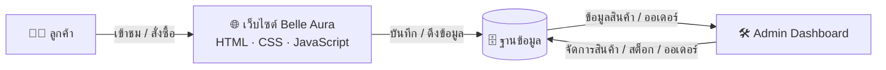
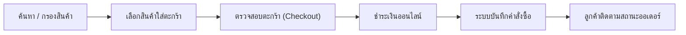

<div align="center">


# 🌸 Belle Aura

### แพลตฟอร์มอีคอมเมิร์ซเครื่องสำอางและสกินแคร์ครบวงจร

**เว็บไซต์ขายเครื่องสำอางออนไลน์ ตั้งแต่หน้าร้านสำหรับลูกค้าไปจนถึงระบบหลังบ้านสำหรับแอดมิน**

[](#)
[](#)
[](#)
[](#)

[](#)
[](#)
[](#)
[](#)
[](#license)

📖 [เอกสารระบบ](#-เอกสารประกอบโครงงาน) ·
🎨 [ดีไซน์บน Figma](#-การออกแบบ-ui) ·
🧩 [แผนภาพ UML](#-การออกแบบ-uml) ·
🚀 [วิธีติดตั้ง](#-การติดตั้ง)

</div>

---

## 📚 สารบัญ

- [เกี่ยวกับโครงงาน](#-เกี่ยวกับโครงงาน)
- [เป้าหมายทางธุรกิจ](#-เป้าหมายทางธุรกิจ)
- [ฟีเจอร์ของระบบ](#-ฟีเจอร์ของระบบ)
- [เทคโนโลยีที่ใช้](#-เทคโนโลยีที่ใช้)
- [สถาปัตยกรรมระบบ](#-สถาปัตยกรรมระบบ)
- [การออกแบบ UI](#-การออกแบบ-ui)
- [การออกแบบ UML](#-การออกแบบ-uml)
- [โครงสร้างโฟลเดอร์](#-โครงสร้างโฟลเดอร์)
- [การติดตั้ง](#-การติดตั้ง)
- [วิธีใช้งาน](#-วิธีใช้งาน)
- [แผนพัฒนาต่อในอนาคต](#-แผนพัฒนาต่อในอนาคต)
- [ผู้จัดทำ](#-ผู้จัดทำ)
- [License](#-license)

---

## 💡 เกี่ยวกับโครงงาน

**Belle Aura** คือโครงงานเว็บไซต์อีคอมเมิร์ซสำหรับขายเครื่องสำอางและผลิตภัณฑ์สกินแคร์ พัฒนาขึ้นในรายวิชา **CSI204 - ดิจิทัลแพลตฟอร์มสำหรับพัฒนาซอฟต์แวร์**

แนวคิดเริ่มต้นมาจากการสังเกตพฤติกรรมลูกค้าเครื่องสำอางยุคใหม่ ที่ต้องการค้นหาสินค้าตามประเภทผิวหรือหมวดหมู่ได้ง่าย เปรียบเทียบสินค้าได้รวดเร็ว และชำระเงินได้อย่างปลอดภัยโดยไม่ต้องออกจากบ้าน ทีมผู้จัดทำจึงออกแบบ Belle Aura ให้เป็นแพลตฟอร์มที่ครบทั้งฝั่งลูกค้าและฝั่งผู้ดูแลร้าน โดยเน้นดีไซน์โทนสี **rose-gold** ที่สื่อถึงความหรูหราและอ่อนโยน เหมาะกับกลุ่มสินค้าความงาม

ระบบแบ่งออกเป็น 2 ส่วนหลัก คือ **หน้าร้านสำหรับลูกค้า** ที่ให้เลือกซื้อสินค้า ค้นหา กรองตามประเภทผิว และชำระเงิน และ **แดชบอร์ดผู้ดูแลระบบ** ที่ใช้จัดการสินค้า สต็อก คำสั่งซื้อ และดูรายงานยอดขาย

---

## 🎯 เป้าหมายทางธุรกิจ

| เป้าหมาย | รายละเอียด |
|---|---|
| 🛒 ขยายช่องทางขาย | เปิดช่องทางขายออนไลน์เพิ่มเติมนอกเหนือจากหน้าร้าน |
| ✨ ยกระดับประสบการณ์ลูกค้า | ให้ลูกค้าค้นหาและเลือกซื้อสินค้าได้สะดวก รวดเร็ว |
| 🔒 ระบบซื้อขายที่ปลอดภัย | รองรับการชำระเงินออนไลน์ที่เชื่อถือได้ |
| 📈 เพิ่มรายได้ธุรกิจ | สร้างช่องทางรายได้ใหม่ให้ธุรกิจเติบโต |
| 📦 บริหารสต็อกอย่างมีประสิทธิภาพ | ควบคุมสินค้าคงคลังแบบเรียลไทม์ผ่านแดชบอร์ด |
| 🚀 รองรับการขยายระบบในอนาคต | ออกแบบสถาปัตยกรรมให้ต่อยอดฟีเจอร์ใหม่ได้ง่าย |

---

## ✅ ฟีเจอร์ของระบบ

<table>
<tr>
<td valign="top" width="50%">

### 👤 ฝั่งลูกค้า

- ✅ หน้าแรก (Home)
- ✅ สมัครสมาชิก / เข้าสู่ระบบ
- ✅ แสดงสินค้าทั้งหมด (Product Catalog)
- ✅ หน้ารายละเอียดสินค้า
- ✅ ค้นหาสินค้า
- ✅ กรองตามหมวดหมู่
- ✅ กรองตามประเภทผิว
- ✅ ตะกร้าสินค้า
- ✅ ขั้นตอนชำระเงิน (Checkout)
- ✅ ชำระเงินออนไลน์
- ✅ โปรไฟล์ผู้ใช้
- ✅ ประวัติคำสั่งซื้อ
- ⏳ สินค้าที่ถูกใจ (Wishlist)
- ⏳ รีวิวสินค้า

</td>
<td valign="top" width="50%">

### 🛠️ ฝั่งผู้ดูแลระบบ

- ✅ ภาพรวมแดชบอร์ด
- ✅ จัดการสินค้า
- ✅ จัดการหมวดหมู่
- ✅ จัดการสต็อกสินค้า
- ✅ จัดการข้อมูลลูกค้า
- ✅ จัดการคำสั่งซื้อ
- ✅ จัดการการชำระเงิน
- ✅ รายงานและวิเคราะห์ยอดขาย
- ✅ จัดการผู้ใช้งาน
- ✅ ตั้งค่าระบบ

</td>
</tr>
</table>

---

## 🧰 เทคโนโลยีที่ใช้

**ฝั่ง Frontend**

[](#)
[](#)
[](#)
[](#)

**ฝั่ง Backend (แผนพัฒนาต่อ)**

[](#)
[](#)

**ฐานข้อมูล (แผนพัฒนาต่อ)**

[](#)

**เครื่องมือที่ใช้ในทีม**

[](#)
[](#)
[](#)
[](#)
[](#)

**เครื่องมือออกแบบ**

[](#)
[](#)
[](#)
[](#)

---

## 🏗️ สถาปัตยกรรมระบบ

ภาพรวมการทำงานของระบบ ตั้งแต่ฝั่งลูกค้าไปจนถึงฝั่งผู้ดูแลระบบ



**เส้นทางการสั่งซื้อของลูกค้า**



---

## 🎨 การออกแบบ UI

หน้าจอทั้งหมดออกแบบด้วย **Figma** ก่อนนำมาพัฒนาเป็นหน้าเว็บจริง เพื่อให้ทีมเห็นภาพรวมและ UX ตรงกันก่อนลงมือเขียนโค้ด

<details>
<summary>📸 ดูภาพหน้าจอทั้งหมด (คลิกเพื่อขยาย)</summary>

| หน้าจอ | ไฟล์ภาพ |
|---|---|
| หน้าแรก | `images/home.png` |
| เข้าสู่ระบบ | `images/login.png` |
| สมัครสมาชิก | `images/register.png` |
| รายการสินค้า | `images/product.png` |
| ตะกร้าสินค้า | `images/cart.png` |
| ขั้นตอนชำระเงิน | `images/checkout.png` |
| หน้าชำระเงิน | `images/payment.png` |
| โปรไฟล์ผู้ใช้ | `images/profile.png` |
| แดชบอร์ดแอดมิน | `images/dashboard.png` |
| จัดการสต็อก | `images/inventory.png` |
| จัดการคำสั่งซื้อ | `images/orders.png` |

</details>

---

## 🧩 การออกแบบ UML

แผนภาพ UML ทั้งหมดออกแบบด้วย **draw.io** เพื่อวางโครงสร้างระบบก่อนเริ่มพัฒนา

<details>
<summary>📐 ดูรายการแผนภาพทั้งหมด (คลิกเพื่อขยาย)</summary>

| แผนภาพ | คำอธิบาย |
|---|---|
| Use Case Diagram | แสดงการทำงานของผู้ใช้แต่ละบทบาทกับระบบ |
| Class Diagram | โครงสร้างคลาสและความสัมพันธ์ของข้อมูลในระบบ |
| Activity Diagram | ลำดับขั้นตอนการทำงานของฟีเจอร์หลัก เช่น การสั่งซื้อ |
| Sequence Diagram | ลำดับการส่งข้อความระหว่างผู้ใช้ ระบบ และฐานข้อมูล |
| ER Diagram | ความสัมพันธ์ของตารางข้อมูลในฐานข้อมูล |

</details>

---

## 📁 โครงสร้างโฟลเดอร์

```
Belle-Aura/
│
├── assets/          # ไฟล์ static ทั่วไป (ฟอนต์, ไอคอน)
├── css/             # ไฟล์สไตล์ทั้งหมด
├── js/              # ไฟล์ JavaScript
├── images/          # รูปภาพหน้าจอและภาพสินค้า
├── pages/           # หน้าเว็บฝั่งลูกค้า
├── admin/           # หน้าเว็บฝั่งแอดมิน
├── README.md
└── index.html
```

---

## 🚀 การติดตั้ง

```bash
# 1. โคลนโปรเจกต์
git clone https://github.com/<username>/Belle-Aura.git

# 2. เข้าไปที่โฟลเดอร์โปรเจกต์
cd Belle-Aura
```

## ▶️ วิธีใช้งาน

1. เปิดโปรเจกต์ด้วย **VS Code**
2. ติดตั้งส่วนขยาย **Live Server**
3. คลิกขวาที่ไฟล์ `index.html` แล้วเลือก **Open with Live Server**
4. เว็บไซต์จะเปิดที่ `http://127.0.0.1:5500` โดยอัตโนมัติ

---

## 🔮 แผนพัฒนาต่อในอนาคต

- [ ] 🤖 ระบบแนะนำสินค้าด้วย AI
- [ ] 💬 Chatbot ให้คำปรึกษาเรื่องผิว
- [ ] 🏷️ ระบบคูปองส่วนลด
- [ ] ❤️ Wishlist สินค้าที่ถูกใจ
- [ ] ⭐ ระบบรีวิวสินค้า
- [ ] 📧 แจ้งเตือนผ่านอีเมล
- [ ] 🌙 โหมดมืด (Dark Mode)
- [ ] 🌐 รองรับหลายภาษา
- [ ] 📱 แอปพลิเคชันมือถือ
- [ ] 🎁 ระบบสะสมแต้ม (Loyalty Program)

---

## 👥 ผู้จัดทำ

| ชื่อ-นามสกุล | บทบาท | GitHub |
|---|---|---|
| [ชื่อสมาชิก 1] | Project Manager | [@วรัตถา เตนากุล](https://github.com/) |
| [ชื่อสมาชิก 2] | Frontend Developer | [@เปมิกา เมฆลอย](https://github.com/) |
| [ชื่อสมาชิก 3] | UI/UX Designer | [@ภัทรพล ถ่อมดี](https://github.com/) |
| [ชื่อสมาชิก 4] | Documentation | [@username](https://github.com/) |

> จัดทำในรายวิชา **CSI204 - ดิจิทัลแพลตฟอร์มสำหรับพัฒนาซอฟต์แวร์**

---

## 📄 License

โครงงานนี้เผยแพร่ภายใต้สัญญาอนุญาต **MIT License**

---

<div align="center">

Made with 🩷 by **Belle Aura Team**

ขอบคุณที่แวะมาเยี่ยมชม repository นี้ 🌸

</div>